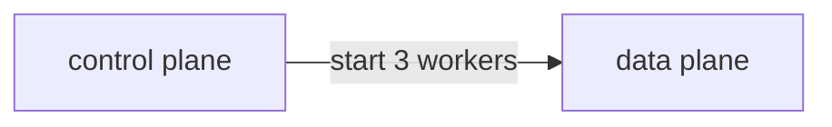
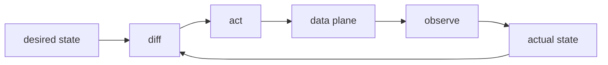
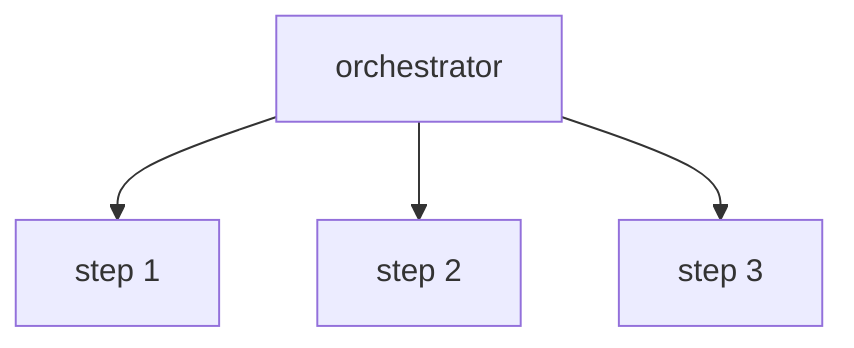
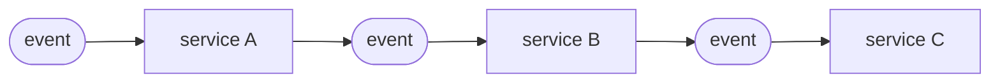

Control planes are everywhere right now. Kubernetes has one. AWS Batch has one. Your job scheduler probably needs one. But "control plane" means different things to different people, and picking the wrong shape can cost you months of rework.

This post walks through the decisions that matter.

---

## What Is a Control Plane?

The control plane makes decisions. The data plane does the work.

A router's control plane decides where packets should go. The forwarding hardware sends them. Kubernetes' control plane decides where pods should run. The nodes run them. A job scheduler decides which worker gets which task. The workers execute it.

If you're building something that manages other systems — provisioning workers, configuring infrastructure, scheduling jobs — you're building a control plane.

---

## Decision 1: Directive or Reconciling?

This is the most important choice.

### Directive

Your control plane sends commands. The data plane obeys.

*Figure: The directive model — the control plane sends a command; the data plane obeys.*

**The problem:** if a command gets lost, the system stays wrong. There's no automatic recovery. You have to build retry logic, acknowledgment tracking, and failure detection yourself — or accept drift.

**When it fits:** reliable message delivery is guaranteed, commands are cheap to replay, and failure modes are simple.

**Real example:** A network router's control plane pushes routing rules to the forwarding hardware. It assumes the hardware does what it's told.

### Reconciling

Your control plane watches the actual state of the world, compares it to what you want, and takes action to close the gap. It runs this loop continuously.

*Figure: The reconciliation loop — observe actual state, diff against desired, act, repeat.*

**The payoff:** it doesn't matter how the world got out of sync — crash, partial failure, someone manually changed something. The next loop iteration fixes it. This is called **self-healing**.

**The cost:** your actuator must be safe to run repeatedly. Running it twice should produce the same result as running it once. This property is called **idempotency**, and designing for it takes discipline.

**When it fits:** distributed systems where partial failure is normal, long-running infrastructure, anything that needs to survive restarts.

**Real example:** Kubernetes controllers. A deployment controller doesn't care why there are only 2 pods when you asked for 3. It just starts a third one.

### The Key Difference

A directive control plane asks: *did my command succeed?*

A reconciling control plane asks: *is the world in the state I want?*

The second question is easier to answer reliably, and easier to recover from when the answer is no.

---

## Decision 2: Orchestration or Choreography?

This one is about *who coordinates*.

### Orchestration

One component is in charge. It tells every other component what to do and when.

*Figure: Orchestration — one coordinator tells every participant what to do and when.*

**The upside:** easy to reason about. The full workflow lives in one place. Debugging means reading one component's logs.

**The downside:** the orchestrator is a single point of failure and a single point of change. Adding a new step means changing the orchestrator.

**When it fits:** workflows with clear sequence dependencies, where you need a clear audit trail, or where the steps are owned by a single team.

### Choreography

No central coordinator. Each component reacts to events and does its part.

*Figure: Choreography — events trigger local reactions; no central coordinator.*

**The upside:** loosely coupled. Adding a new participant means deploying one new service that subscribes to existing events. Nobody else changes.

**The downside:** the workflow is implicit — it's the emergent result of all the event subscriptions. Debugging requires tracing events across services. Failures are harder to detect because no single component knows the full picture.

**When it fits:** high-scale pipelines, independently-owned services, situations where you want to add participants without coordinating deploys.

---

## How They Combine

These two decisions are independent. You can mix them:

| | Orchestration | Choreography |
|---|---|---|
| **Directive** | Job scheduler with a central dispatcher | Message queue with competing consumers |
| **Reconciling** | Kubernetes (central API server, many controllers) | OSPF routing (each router reconciles its own table) |

Most systems land in the top-left (directive + orchestration) because it's the simplest to build and reason about. Most *resilient* systems eventually move toward reconciling, because directive systems accumulate edge cases around failure.

---

## Quick Decision Guide

**Start with reconciling if:**
- Your data plane can fail, restart, or drift independently
- You need self-healing without operator intervention
- You're managing long-lived infrastructure

**Start with directive if:**
- Delivery is guaranteed and failures are simple
- You need low latency between decision and action
- The system is small and failure modes are well-understood

**Choose orchestration if:**
- One team owns the whole workflow
- You need a clear audit trail
- Steps have strict ordering dependencies

**Choose choreography if:**
- Multiple teams own different steps
- You want to add participants without coordinating deployments
- Scale matters more than workflow visibility

---

## The Bottom Line

Directive control planes are simpler to build and harder to keep correct. Reconciling control planes are harder to build and easier to keep correct.

If you're managing anything that can fail independently — workers, infrastructure, long-running jobs — start with reconciling. You'll pay the upfront design cost once. With directive, you pay the reliability cost forever.
